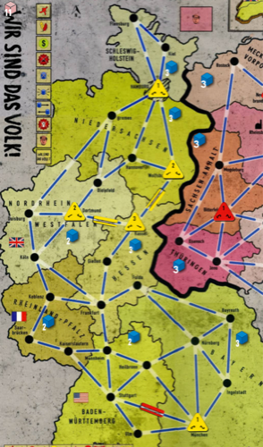
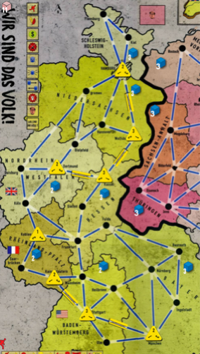
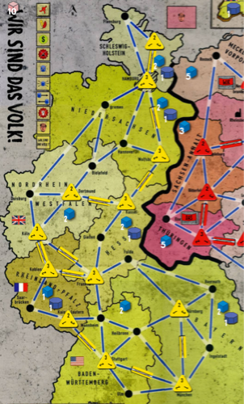

🇩🇪

[Wir Sind Das Volk!](https://boardgamegeek.com/boardgame/165401/wir-sind-das-volk) is a good board game.

These thoughts will not be meaningful without knowledge of the [rules](http://www.histogame.de/WSDV/Wir.sind.das.Volk.Rules.pdf) and perhaps a few games in person, or on [boardgamescore](http://play.boardgamecore.net).

### Language

I will use the values between **-6 and +6** to refer to spots on the prestige, western currency (wc) and socialist track. -6 is the spot on the West side furthest from the middle.

I will also refer to the first half of decade 1 as **D1.0**, the second half of decade 1 as **D1.5** and so on. So D3.5 refers to the second half of decade 3.

I will also refer to the player going first in the decade (because of prestige advantage) as **P1** and the other player as **P2**.

I will also refer to living standard as LS.

### For both sides

#### Choosing card modes

Building is an important action. Building infrastructure is more economy-efficient as it increases economy by 2 while a new factory increases economy by 1. It's important to have a plan on where to build ([west](#Where-to-build-and-LS-West) | [east](#Where-to-build-and-LS-East)) to maximise infrastructure while meeting other economic objectives.

Playing a card for the event is often worse than using it to build. It's important to have some kind of exchange rate between different effects and regular build points. For example, although the _1953 Uprising_ has a strong effect, the 4 build points are often more valuable in D1.

Add living standard is more efficiently done with 1-value cards, as the shortfall that it bridges could usually be replaced by a build point, which is permanent, which contributes to economy/export factory value and also can be dismantled for future 'remove unrest' actions.

Spending a card to remove unrest is important when removing important mass protests, and it can be important for East in D4. In other cases, it is not efficient.

#### Playing cards from the board

In each half-decade, 7 cards are laid out on the board. Each card has a value to each player, which often different. For example, _1953 Uprising_ is worth at least 4 build points to West and at least 1 build point to East. We can say that the swing value is at least 5 build points. Naively, we can say that we can extract most relative value from the board cards by taking the cards with the highest swing value. However, the values of cards in WSDV are often dynamic depending on board state, tracks, hand cards and other cards on the board. Nevertheless, it's useful to think about the swing value of cards.

#### Playing hand cards

It is generally best to play hand cards when 1 card is left on the board in the first half of each decade (D1.5, D2.5, ...). In every other situation, the opponent gets to take an extra card from the board, which results in them either getting better picks of the cards or them getting to play more cards than us.

In the usual case, at the end of each first-half-decade, P1 has the power to choose how many hand cards to play and P2 must either follow suit or give up the first pick of the second-half-decade, which is the card with the highest swing value. As there are some particularly strong cards in each decade, this is a great advantage of being P1.

P1 should play their strong hand cards at the end of each first-half-decade. A large advantage can be gained if they have strong hand cards and P2 is forced to play weak hand cards. If P1 has weak hand cards, they can _rush_ the decade by playing no hand cards and P2 will need to give up some board cards to play his hand cards. P1 should generally not play weak cards from hand, since it gives P2 an easy opportunity to play a strong card if they have one.

There are two exceptions to playing strong hand cards at the ends of the first-half-decades. The first is having unrest removal in hand as West in D2 and the board having no mass protest. It is good to save the unrest removal until after East plays unrest cards in D2.5. The second exception is having _Shipyards Crisis_ or _Oil Crisis_ as East. These are often useful to save for late in the decade to play, where the opponent often cannot repair the damage done before the decade ends.

#### Prestige

The prestige track is of high importance overall, but parts of the track differ in [_temperature_](https://senseis.xmp.net/?TemperatureCGT) (urgency of contesting the track). The middle of the track is the hottest, where it swings between -1 step (towards West) and +1 step (towards East). Between -1 and -4 is the coolest part of the track, as there is relatively little difference between 1 rundown and 1 dismantle + 1 unrest.

Becoming P1 is the biggest reward of prestige. They decide how many hand cards can be conveniently played in the decade and they get increased value from odd numbers of dismantles from flight and rundowns from WC shortage.

Gaining 1 build as East is also a great reward. It often allows East to negate the effects of flight dismantles hurting East's export factories (which cause WC shortage and rundowns).

Removing 1 unrest as East is comparable to gaining 1 build. It's sometimes worse. The prestige +3 bonus is strong, with both 1 build and 1 unrest removal. It's often stronger than the +4 bonus of LS. The LS needs to be maintained by economy and paid for by WC, and is generally only good in D4 when survival is all that matters.

Going past +6 prestige as East is a rare occurrence, but is powerful when unrest is already a problem for West.

Gaining 1 rundown as West is a similarly powerful reward. Factories which haven't been run down are important resources to skilled East players, because they prevent WC shortage in D4 from dismantling infrastructure. The 1 rundown can often cause a WC shortage especially in D1, which is worth another rundown.

LS removal at -5 and -6 prestige is generally very strong, once West's border provinces have at least 2 LS on them. What commonly happens is that LS removal leads to 2 to 3 extra unrest hits, 2 from the neighbouring West provinces and 1 from internal LS comparison if any provinces have 2 LS already. This means that -5 and -6 prestige can cause a total of 3-4 unrest, which can be a killing blow to an otherwise solid East side in D4.

#### Timing of building vs LS

Between the building and LS actions, LS actions should be left to as late in the decade as possible, since LS doesn't help at all during the decade, whereas build helps create economy for LS.

### As West Germany

#### Where to build and LS (West)

Where to build factories and infrastructure is of crucial importance. An efficient plan of build generates more economy and reaches minimum export of 2 and 3 earlier than an inefficient plan.

With 6 build, West can achieve this first milestone. West can now place LS in Nieder, Hessen and West Berlin(from NordWest) with a 1-value card. The hanging connection from München allows us to LS there with a 1-value card in case East places mass protest in Bayern via _Gottingen Eighteen_ or _Founding of the FDJ_. The LS there removes 1 unrest and protects Bayern from further LS attack, which would otherwise often be critical damage.

With 11 build, West can achieve this next milestone. Here, West has a minimum export level of 2 and can LS in West Berlin and each border province, as well as either RheinPfalz or Baden to prepare for the 2nd LS to West Berlin. 

In this configuration, it's ideal if West can supply the first LS to West Berlin from Baden (then the 2nd LS from RheinPfalz and 3rd from NordWest) instead of from NordWest as set up in the first milestone. This is for two reasons. First, Baden is the only West Berlin supplier which can have an export level of 3 with only one factory, that makes Baden most efficient as the first supplier, since the first supplier only needs 2-3 economy. Any extra build should be allocated to other provinces. Second, NordWest is the set target of the _Steel Crisis_ in D3. By having it as the third supplier to West Berlin, it will naturally be the most built up and unrest is naturally removed from it by the first two LS added to it. This acts as a convenient defense towards the otherwise potentially troublesome _Steel Crisis_.

However, it's no big loss if NordWest is the first West Berlin supplier.

With 20 build, West can get a very strong position as shown here. This build assumes that the first supplier to West Berlin was Baden. The second supplier here is RheinPfalz. The position has a minimum export level of 3 and can develop 2 LS in all border provinces and West Berlin. With just two more build points in NordWest, West can have 8 economy there and deliver the 3rd LS to West Berlin. Such a position, together with the events in D4, is often enough to craft the unrest victory in D4.

#### Hamburg

West should prefer to LS in at least one Hamburg province (Nieder or Schleswig) for each LS action. An easy mistake to make is to forget that Hamburg cannot count for both provinces, and thus be unable to LS in both Nieder and Schleswig in the same action.

#### Managing unrest

It is important to be familiar with East's cards that cause unrest, as well as West's cards which quell unrest.

In D1, East has _Gottingen Eighteen (2 unrest excl. WB)_ and _Founding of the FDJ (1 unrest)_.

D2 has the biggest unrest threat.

The largest threat of unrest is having a province with unrest dismantled so that it cannot support any LS.

**WIP**

#### D4

**WIP**

### As East Germany

**WIP**

#### Where to build and LS (East)

**WIP**

#### The Wall

**WIP**

#### Placing unrest

**WIP**
